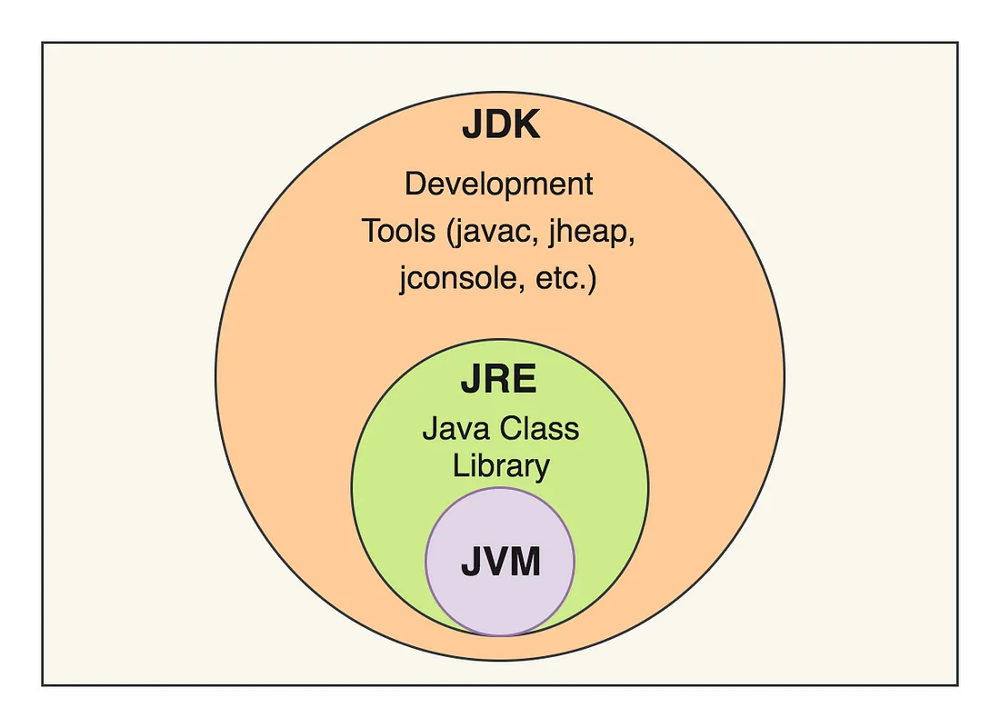

# JDK vs JRE vs JVM.

- JDK - Java Development Kit.
  - Include Java Runtime.
  - Only need to write Java Code.
- JRE - Java Runtime Enviroment.
  - Require to run Java Application.
  - Run java byte code on machine it is on.
  - Contain standalone JVM.
- JVM - Java Virtual Machine.
  - Write once and run anywhere.
  - Act as sandbox to run java byte code.
  

